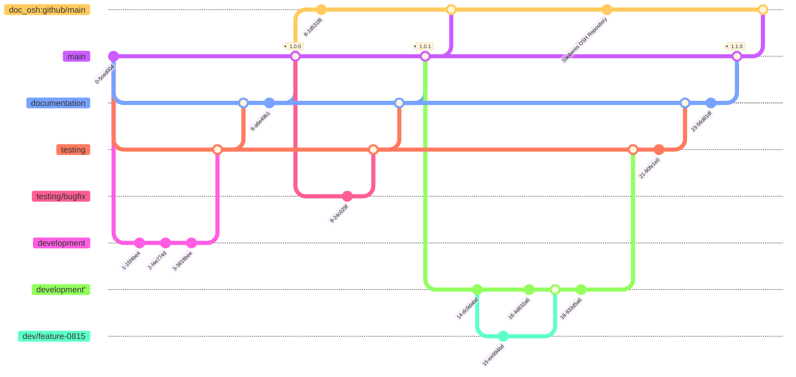

# OSHOP Electronics Testing Module (OSH Demonstrator)

Dieses Elektronik-Testmodul (OSHOP-E-Testing-Module) ist eine Erweiterung des IIoT-Test-Bettes der HTW Dresden. Es ist als Open-Source-Hardware-Komponente innerhalb des "Open Source Hardware Innovation Platform" (OSHOP) Projekts konzipiert. Neben seiner Funktion im IIoT-Test-Bett dient es der Analyse und Bewertung der besten Praktiken in der Entwicklung unter Open-Source-Hardware-Prinzipien. Das Repository dient also mehr dazu, die Stärken und Schwächen des Open-Source-Konzepts für die Entwicklung von Maschinen und Geräten in der aktuellen Zeit zu dokumentieren.

[TOC]

## Beschreibung

Das OSHOP-E-Testing-Modul erweitert das IIoT-Test-Bed der Arbeitsgruppe Smart-Production-Systems an der HTW Dresden um ein Elektronik-Testmodul. Das IIoT-Test-Bed stellt eine vereinfachte Industrie 4.0 Produktionslinie dar und demonstriert die flexible Verknüpfung mehrerer Module, welche sich an ein bestimmtes Produkt adaptiv anpassen kann. Die Aufgabe des OSHOP-E-Testing-Moduls ist die elektronische Prüfung eines Geräts (vereinfachtes Modell). Die Entwicklung des OSHOP-E-Testing-Moduls erfolgt im Rahmen des OSHOP-Projekts unter Anwendung von "Open Source Prinzipien". Das IIoT-Test-Bed basiert auf CP Factory Modulen der Firma Festo. Ebenso wird das OSHOP-E-Testing-Modul zunächst nur innerhalb dieser Umgebung genutzt werden können. Der allgemeine Mehrwert dieses Demonstrators liegt daher in den gewonnenen Erkenntnissen um die Entwicklung von OSH zu vereinfachen und weiter voranzubringen.

## Vorgehen und Ziele

- Untersuchung verschiedener Aspekte:
    - Anwendbarkeit von Git zur Hardware-Entwicklung (Open Source Hardware)
        - Versionierung
        - Veränderungsnachverfolgung
        - Verwaltung von Abhängigkeiten
            - Verschachtelung von Komponenten als Git-Submodule
        - Branching für kollaboratives Arbeiten
    - Zusammenspiel/Mischung von proprietären und OSH-Designs
        - Integration externer Komponenten
- Entwicklung einer übergreifenden intuitiven/ergonomischen Projektstruktur in Anlehnung an häufig anzutreffende Strukturen in Open Source Software (OSS) Repositories
    - Vergleich und Evaluation verschiedener Standards und OSH-Repositories
        - `osh-dir-std`
        - `DIN EN 81346` -> Namenskonventionen
    - Namenskonventionen
        - Erprobung praktikabler Benennungsvorschriften
- Bill of Materials (BOM)
    - Entwicklung einer BOM-Struktur
    - langfristig Erprobung einer automatischen Generierung einer BOM
        - Auswertung von Submodulen
        - Möglichkeiten zur manuellen Modifikation entwickeln
- Projektdokumentation
    - Anwendung von etablierten Vorgehensweisen in der OSS Entwicklung
        - Dokumentation auf Basis von Markdown (`Readme.md`) und Erprobung von darauf aufbauenden Toolchains
        - Möglichkeiten der Automatisierung erproben ("Doku-Pipeline")
    - Dokumentation von Use-Cases als Basis für weitere Entwicklung im OSHOP-Projekt
        - allgemeiner Entwicklungsprozess
            - Bauteilmodellierung
            - Recherche und Integration externer freier und proprietärer Designs
        - Git-Workflow
    - Identifikation notwendiger Dokumente hinsichtlich rechtlicher Aspekte
        - Funktionsbeschreibung
            - `TRL`-Bewertung (Basis für Haftungsrechtliche Fragen)
        - Aufbauanleitung
        - Technische Dokumentation
            - Schaltpläne (Pneumatik, Elektrik)
            - Software
        - Software-Dokumentation
        - Gefährdungsbeurteilung
            - FMEA
        - Tests/Simulationen
- Lizenzierung
    - Kompatibilität verwendeter Lizenzen prüfen
        - Copyleft
    - Lizenzverwaltung mittels `REUSE` nach `SPDX`

## Status

Zum jetzigen Zeitpunkt hat der Demonstrator noch keinen funktionsfähigen Stand erreicht. Aktuell werden die Programme zur Steuerung der Antriebe sowie der Pneumatik geschrieben. Eine Aufbauanleitung und BOM kann daher noch nicht bereitgestellt werden, da sich die aktuellen Entwicklungsvorgänge auf die bisherige Konstruktionen auswirken und ständige Anpassungen erfahren. Des Weiteren sind viele verwendete Teile, wie Schläuche, Kabel, Schrauben, etc. nicht vollständig modelliert. Veränderungen bedürfen daher einer ständigen manuellen Aktualisierung der Dokumente.

Dieses öffentliche Repository beinhaltet ausschließlich frei lizenzierte Designs. Proprietäre Modelle wurden entfernt.

## Aktuelle TODOs:

- TODO:
    - [ ] Lizenzen mittels REUSE verwalten
    - [ ] Nachmodellierung proprietärer Modelle um öffentliches Repository zu vervollständigen
    - [ ] Aufbauanleitung
    - [ ] Technische Dokumentation
        - [ ] Schaltpläne
        - [ ] Software
    - [ ] Steuerungssoftware
    - [ ] Git-Workflow dokumentieren
        - [ ] Branching-Modell
    - [ ] BOM
    - [ ] vollständige Umsetzung der dokumentierten Konventionen
        - [ ] einheitliche Benennung aller Dateien
        - [ ] Auslagerung von Unterbaugruppen und Teilen in separate Repositories (Submodule)

- DONE:
    - [x] Grundstrukturierung des Projekts
    - [x] Initialisierung Git-Repository und Migration der Modelle

## Abhängigkeiten

- Arduino 
    - Steuerung des Linearantriebs (Z-Achse)
- Siemens NX
    - wird zur Modifikation der CAD-Designs benötigt
- CP Factory
    - zur Steuerung und zur Versorgung des Moduls mit Energie (Elektrisch, Pneumatisch)
    - Anschluss an SPS
    - Festo Tec2Screen/iEasyLab zur Pneumatiksteuerung/für Werkzeugwechselmechanismus
- Proprietäre Modelle
    - dieses öffentliche Repository beinhaltet keine proprietären CAD-Modelle
    - siehe `doc/functional_hardware_structure.md` um zu sehen welche Komponenten ausgeschlossen wurden

## Projectstructure 

Die Projektstruktur ist an die Überlegungen des `osh-dir-std` angelehnt, weicht aber davon ab um diese aus Sicht eines Konstrukteurs verständlicher zu machen. Um Laufe der Entwicklung wird diese Struktur weitere Veränderungen erfahren.

- `doc`
    - Dokumentation
    - `drafts`
        - Notizen und Überlegungen, unstrukturiert, Dokumentation des Entwicklungsprozesses
    - `media`
        - gerenderte Ansichten
        - Animationen
- `src`
    - `electronic` (anticipated)
    - `hardware`
        - enthält alle Quelldateien im Siemens NX `.prt` Format
        - siehe `doc/functional_hardware_structure.md` für detaillierte Informationen über die Montage und Submodule
        - `printing`: STL-Dateien für den Druck, Prototyping, analog zu ``build`` oder ``bin`` Verzeichnis in der Softwareentwicklung
            - könnte in der Zukunft wegfallen, falls die Generierung zu automatisiert werden kann 
    - `software`
- `LICENSES`
    - REUSE/SPDX Lizenzdateien zur Verwaltung verschiedener Lizenzen
- `LICENSE.md`
    - Übersicht über die im Projekt verwendeten Lizenzen
- README.md
    - Projektbeschreibung, allgemeine Informationen

## Lizenz

Für alle selbst erstellten Komponenten, Quelltexte und Dokumentationsressourcen gelten folgende Lizenzen:

- Software: AGPL
- Hardware/Electronics: CERN-OHL-S
- Dokumentation: CC-BY-SA-4.0

## Versioning

Als Konvention für aussagekräftige Versionsbezeichnungen nutzen wir die [Semantic Versioning Specification v2.0.0](https://semver.org/).

Die Versionsnummer besitzt folgende Struktur `MAJOR.MINOR.PATCH`.
Eine Erhöhung der jeweiligen Stelle bedeutet:

- `MAJOR` Version bei inkompatiblen Schnittstellenänderungen
- `MINOR` Version bei Hinzufügung neuer Funktionen mit Rückwärtskompatibilität
- `PATCH` Version bei Rückwärtskompatiblen Fehlerbehebungen oder anderen kleineren Änderungen

## Branching

Für die Entwicklung mit Git wurde zunächst folgende Branching-Struktur gewählt:

| branch               | Bedeutung                                                                                     |
| -------------------- | --------------------------------------------------------------------------------------------- |
| `main`               | Releases von getesteten und dokumentierten Versionen                                          |
| `documentation`      | Dokumentation von erfolgreich getesteten Änderungen, die aus `testing` zusammengeführt wurden |
| `testing`            | Testen von zusammengeführten Änderungen aus `development`                                     |
| `development`        | Allgemeine Entwicklung                                                                        |
| `dev/<feature-name>` | Getrennte Entwicklung einer neuen Funktion `<feature-name>`                                   |

Da im öffentlichen Repository keine proprietären Modelle enthalten sein dürfen, existiert diese Branching-Struktur aktuell nur im internen Repository.
In bestimmten Abständen wird daher eine OS-Variante veröffentlicht.
Das nachfolgende Diagramm soll die Arbeitsweise veranschaulichen.

**Anmerkungen**

- Die Branches `<branch>` und `<branch>'` sind identisch und müssten in einer Linie dargestellt werden
- `<branch>'` stellt einen `rebase` auf den entsprechenden Commit dar, wo die Entwicklung weiter gehen soll um unnötige Merges zu vermeiden
- das hier verwendete Plugin für das Diagramm `mermaid.js` mit `gitGraph` beherrscht aktuell noch keinen Rebase
