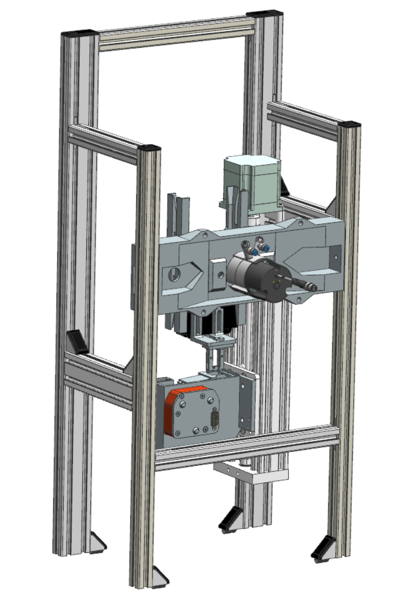
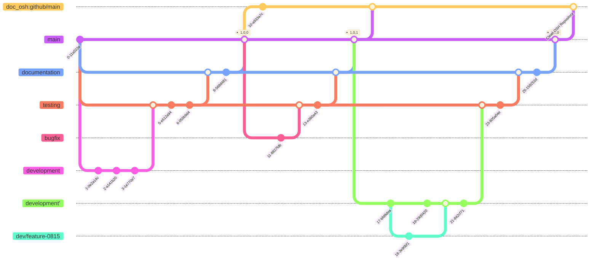

# OSHOP Electronics Testing Module (OSH Demonstrator)

This Electronics Testing Module (OSHOP-E-Testing-Module) is an Extension of the IIoT Test Bed of the HTW Dresden. It is intended to be designed as an Open Source Hardware component within the scope of the "Open Source Hardware Innovation Platform" (OSHOP) project. In addition to its function in the IIoT Test Bed, it serves the analysis and evaluation of best practices in development under Open Source Hardware principles. The repository thus serves more for documenting the strengths and weaknesses of the Open Source concept for the development of machinery and equipment at the current time.

[TOC]

## Description

The OSHOP-E-Testing-Module extends the IIoT Test Bed of the Smart-Production-Systems group at the HTW Dresden with an Electronics Test Module. The IIoT Test Bed represents a simplified Industry 4.0 production line and demonstrates the flexible connection of several modules that can adapt to a specific product. The task of the OSHOP-E-Testing-Module is the electronic testing of a device (simplified model). The development of the OSHOP-E-Testing-Module takes place within the framework of the OSHOP project using "Open Source principles". The IIoT Test Bed is based on CP Factory Modules from the company Festo. Similarly, the OSHOP-E-Testing-Module will initially only be usable within this environment. The general value of this demonstrator lies therefore in the gained insights to simplify the development of OSH and to further advance it.

## Procedure and Goals

- Investigation of various aspects:
    - Applicability of Git for hardware development (Open Source Hardware)
        - Version control
        - Change tracking
        - Dependency management
            - Nesting of components as Git submodules
        - Branching for collaborative work
    - Interaction/mix of proprietary and OSH designs
        - Integration of external components
- Development of an overarching intuitive/ergonomic project structure in line with frequently encountered structures in Open Source Software (OSS) repositories
    - Comparison and evaluation of various standards and OSH repositories
        - `osh-dir-std`
        - `DIN EN 81346` -> Naming conventions
    - Naming conventions
        - Testing practical naming regulations
- Bill of Materials (BOM)
    - Development of a BOM structure
    - Long-term testing of automatic generation of a BOM
        - Evaluation of submodules
        - Development of possibilities for manual modification
- Project documentation
    - Application of established procedures in OSS development
        - Documentation based on Markdown (`Readme.md`) and testing of subsequent toolchains
        - Possibilities of automation testing ("Docs Pipeline")
    - Documentation of use cases as a basis for further development in the OSHOP project
        - General development process
            - Component modeling
            - Research and integration of external free and proprietary designs
        - Git workflow
    - Identification of necessary documents regarding legal aspects
        - Function description
            - `TRL` evaluation (Basis for legal questions)
        - Assembly instructions
        - Technical documentation
            - Schematics (Pneumatics, Electricity)
            - Software
        - Software documentation
        - Hazard assessment
            - FMEA
        - Tests/Simulations
- Licensing
    - Checking compatibility of used licenses
        - Copyleft
    - License management via `REUSE` according to `SPDX`

## Status

At the moment, the demonstrator has not yet reached a functional state. Currently, the programs for controlling the drives and pneumatics are being written. Therefore, an assembly instruction and BOM can currently not be provided, as the current development processes affect the existing constructions and require constant adjustments. Furthermore, many used parts, such as hoses, cables, screws, etc., are not fully modeled. Changes therefore require constant manual updating of the documents.

This public repository includes only freely licensed designs. Proprietary models have been removed.

## Current TODOs:

- TODO:
    - [ ] Manage licenses using REUSE
    - [ ] Remodeling of proprietary models to complete the public repository
    - [ ] Assembly instructions
    - [ ] Technical documentation
        - [ ] Schematics
        - [ ] Software
    - [ ] Control software
    - [ ] Documenting Git workflow
        - [ ] Branching model
    - [ ] BOM
    - [ ] Complete implementation of the documented conventions
        - [ ] Uniform naming of all files
        - [ ] Outsourcing of subassembly groups and parts into separate repositories (Submodules)

- DONE:
    - [x] Basic structuring of the project
    - [x] Initialization of Git repository and migration of models

## Dependencies

- Arduino 
    - Control of the linear drive (Z-axis)
- Siemens NX
    - Needed for modifying CAD designs
- CP Factory
    - For controlling and powering the module (Electric, Pneumatic)
    - Connection to SPS
    - Festo Tec2Screen/iEasyLab for pneumatic control/tool change mechanism
- Proprietary Models
    - This public repository does not include proprietary CAD models
    - See `doc/functional_hardware_structure.md` to see which components were excluded

## Project Structure 

The project structure is based on the considerations of the `osh-dir-std`, but deviates from it to make it more understandable from the perspective of a constructor. This structure will undergo further changes during development.

- `doc`
    - Documentation
    - `drafts`
        - Notes and considerations, unstructured, documentation of the development process
    - `media`
        - Rendered views
        - Animations
- `src`
    - `electronic` (anticipated)
    - `hardware`
        - Contains all source CAD-files in Siemens NX `.prt` format
        - See `doc/functional_hardware_structure.md` for detailed information about the assembly and submodules
        - `printing`: STL files for printing, prototyping, analogous to the `build` or `bin` directory in software development
            - May be dropped in the future if we are able to automate the generation 
    - `software`
- `LICENSES`
    - REUSE/SPDX license files for managing different licenses
- `LICENSE.md`
    - Overview of used licenses in the project
- README.md
    - Project description, general information

## License

For all self-created components, source texts, and documentation resources, the following licenses apply:

- Software: `AGPL`
- Hardware/Electronics: `CERN-OHL-S`
- Documentation: `CC-BY-SA-4.0`

## Versioning

As a convention for meaningful version numbers, we use the [Semantic Versioning Specification v2.0.0](https://semver.org/).

The version number has the following structure `MAJOR.MINOR.PATCH`.
An increase in each of the places means:

- `MAJOR` version when you make incompatible interface changes
- `MINOR` version when you add new features with backward compatibility
- `PATCH` version when you make backward compatible bug fixes or other minor changes

## Branching

For development with Git, the following branching structure was initially chosen:

| branch               | meaning                                                             |
| -------------------- | ------------------------------------------------------------------- |
| `main`               | releases of tested and documented versions                          |
| `documentation`      | documentation of successfully tested changes merged from `testing`  |
| `testing`            | testing of merged changes from `development`                        |
| `development`        | general development                                                 |
| `dev/<feature-name>` | separated development of new feature <feature-name>                 |

Since proprietary models are not allowed in the public repository, this branching structure currently only exists in the internal repository.
Therefore, an OS variant is published at certain intervals.
The following diagram is intended to illustrate the workflow.

**Notes**

- The branches `development` and `development'` are identical and should be displayed in the same line
- `development'` represents a `rebase` on the corresponding commit where development should continue to avoid unnecessary merges
- the plugin used for the diagram `mermaid.js` with `gitGraph` currently does not support `rebase`
